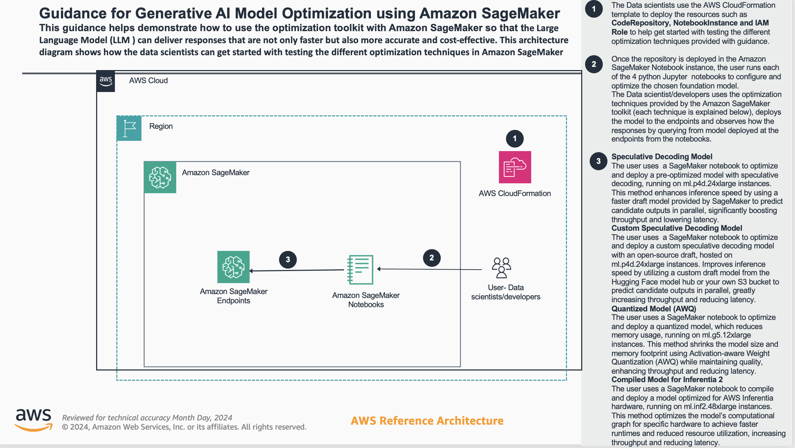
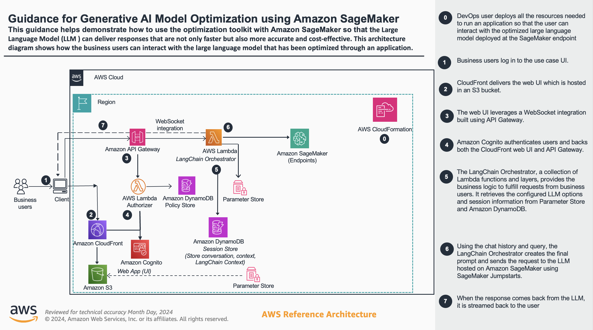

# Guidance for Generative AI Model Optimization using Amazon SageMaker

## Table of Content (required)

1. [Overview](#overview-required)
    - [Cost](#cost)
2. [Prerequisites](#prerequisites-required)
    - [Operating System](#operating-system-required)
3. [Deployment Steps](#deployment-steps-required)
4. [Deployment Validation](#deployment-validation-required)
5. [Running the Guidance](#running-the-guidance-required)
6. [Next Steps](#next-steps-required)
7. [Cleanup](#cleanup-required)


## Overview (required)

The guidance on "Generative AI Model Optimization using Amazon SageMaker" addresses the growing need to optimize the performance and cost-effectiveness of large language models (LLMs) deployed on cloud platforms.

The key objectives of this guidance are:

1. **Improving Inference Speed**: The guidance introduces techniques like speculative decoding and model quantization to significantly enhance the inference speed of LLMs, leading to faster response times for business applications.

2. **Enhancing Accuracy and Cost-Effectiveness**: The guidance aims to help organizations strike the right balance between inference speed, model accuracy, and cost-efficiency when running these models in production.

The main problem this guidance solves is the challenge of optimizing the performance and cost-efficiency of LLMs on Amazon SageMaker. Specifically, it addresses the following pain points:

- **Slow Inference Speeds**: The guidance provides techniques to accelerate inference, as LLMs can be computationally intensive, leading to slow response times.
- **Model Accuracy Trade-offs**: The guidance helps maintain a balance between speed and accuracy, as optimizing for speed can sometimes come at the cost of model accuracy.
- **High Infrastructure Costs**: The guidance introduces methods to reduce the cost of infrastructure and cloud resources, as running large, complex LLMs can be expensive.

By providing a comprehensive set of optimization techniques and a step-by-step approach, the guidance empowers developers and data scientists to effectively optimize their LLMs on Amazon SageMaker, leading to faster, more accurate, and cost-efficient AI-powered applications.




### Cost ( required )


### Sample Cost Table ( required )


## Prerequisites (required)

* Make sure that the `ml.p4d.24xlarge` and `ml.inf2.48xlarge` instance types required for this tutorial are available in your AWS Region.
* Make sure that the value of your "ml.p4d.24xlarge for endpoint usage" and "ml.inf2.48xlarge for endpoint usage" Amazon SageMaker service quotas allow you to deploy at least one Amazon SageMaker endpoint using these instance types.


## Deployment Steps (required)
1. 1. Clone the repo using command ```git clone ``` 
**Example:**

1. Download this repository
2. Navigate to the deployment folder
3. In the AWS Console, navigate to Cloudformation and upload the template in the deployment folder.
4. Once deployment is complete, navigate to SageMaker. In the left pane, under select **Notebooks** under **Applications and IDEs**
5. Select the newly create notebook and select **Open Jupyter**
6. Navigate to the 4 notebooks. Each notebook walks you through the steps to optimize the model and then deploy it.
7. If you would like to test this newly optimized endpoint with an application as shown in the second architecture diagram above, then use the 
   
8. If multiple application are needed to perform queries against each endpoint, then use the solution. 


## Deployment Validation  (required)

* Open CloudFormation console and verify the status to be **CREATE_COMPLETE**
* If deployment is successful, you should see the notebook in the SageMaker console.
* If deploying the SageMaker Chat template from generative ai application builder on AWS solution, check for the status of the deploymnet to be **CREATE_COMPLETE** then navigate to the outputs tab in cloudformation and select the UI url and login with the credentials provided through Cognito sent to your email.


## Running the Guidance (required)

1. Each of the 4 notebooks provided  comes with its own code to test a successful deployment of the optimized model at the endpoint. So run the cells in Jupyter one by one and deploy the model at the endpoint.
2. If the Generative AI Application Builder on AWS is deployed to have an application that communicates to this newly optimized endpoint, then follow the steps provided in this 


## Next Steps (required)

You can run each optimization technique and observe the results. Use these two blogs to get an advanced understanding of these optimization techniques.


## Cleanup (required)

 Once tested you can delete the endpoints.

## Notices (optional)

*Customers are responsible for making their own independent assessment of the information in this Guidance. This Guidance: (a) is for informational purposes only, (b) represents AWS current product offerings and practices, which are subject to change without notice, and (c) does not create any commitments or assurances from AWS and its affiliates, suppliers or licensors. AWS products or services are provided “as is” without warranties, representations, or conditions of any kind, whether express or implied. AWS responsibilities and liabilities to its customers are controlled by AWS agreements, and this Guidance is not part of, nor does it modify, any agreement between AWS and its customers.*


